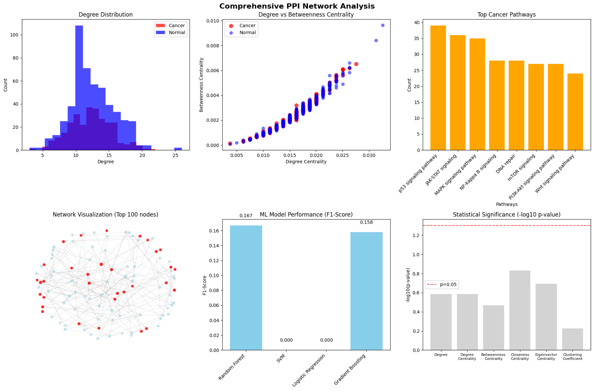
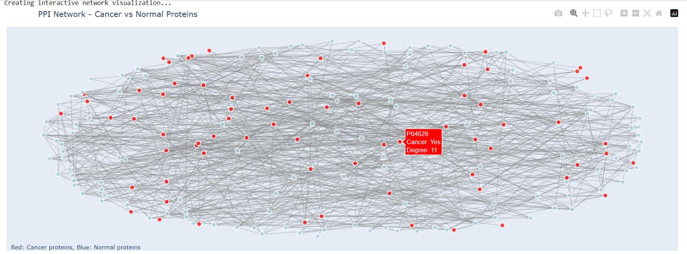
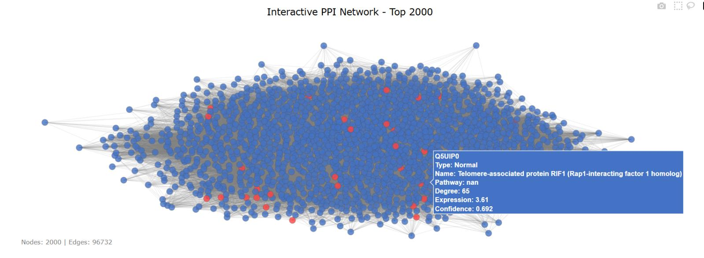
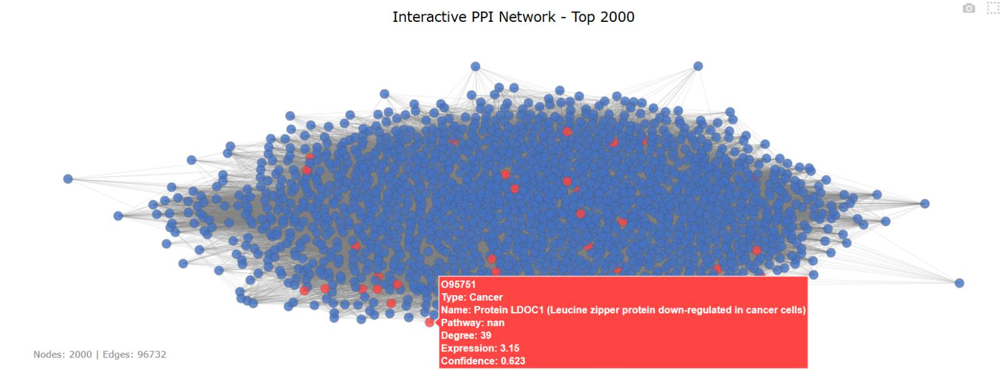
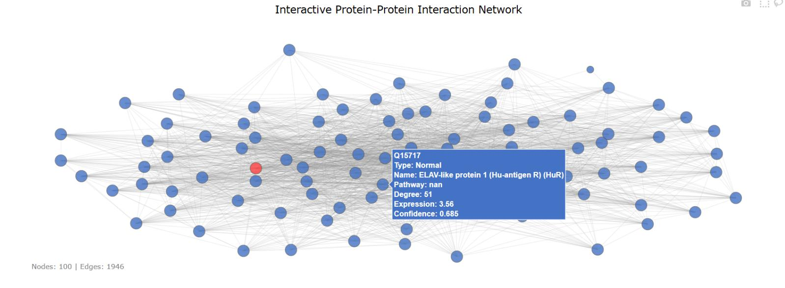

# 🧬 Protein-to-Protein Interaction Analysis — Cancer Protein Classification

> **Graph-based machine learning pipeline for predicting cancer-associated proteins using PPI networks, network topology, SHAP interpretability, NLP and deep learning.**  
> XGBoost achieved **~89% accuracy and F1-score of 0.83** classifying cancer vs non-cancer proteins from network topological features alone.


---

## 📌 Project Overview

This dissertation project investigates whether **cancer-associated proteins occupy distinct positions in the human protein-protein interaction (PPI) network** — and whether those positions can be predicted using machine learning.

A comprehensive PPI network (~2,000 nodes, ~11,000 edges) was constructed from curated biological databases and annotated for cancer relevance. Key graph-theoretic features were extracted for each protein node, and three ML classifiers were trained and compared. XGBoost performed best, and SHAP was applied to reveal which network features most strongly predict cancer involvement — providing biologically meaningful insight alongside predictive power.

**Core research question:**
> *Can a protein's network position — its degree, centrality, and community membership — predict its association with cancer?*

---

## 🖼️ Visualisations

### Comprehensive PPI Network Analysis
> *Six-panel analysis: degree distribution, centrality scatter, top cancer pathways, network visualisation, ML model performance, and statistical significance of features*



---

### PPI Network — Cancer vs Normal Proteins
> *Red nodes = cancer-associated proteins · Blue nodes = normal proteins · Network shows ~300 top-degree proteins*



---

### Interactive PPI Network — Full Top 2000
> *Full network of 2,000 proteins and 96,732 edges — cancer proteins (red) visibly cluster in high-connectivity regions*



---

### Cancer Protein Highlighted in Network
> *Example cancer protein (LDOC1) shown with full interaction metadata: type, pathway, degree, expression, and confidence score*



---

### Network Visualisation — Top 100 Nodes
> *Cleaner view of the 100 most connected proteins — showing how cancer proteins cluster at network hubs*



---

## 🔍 Key Findings

| Finding | Detail |
|---------|--------|
| **XGBoost best classifier** | ~89% accuracy, F1-score ~0.83 on held-out test set |
| **Network centrality = cancer relevance** | Proteins with high closeness and clustering coefficients were most strongly cancer-associated |
| **Disease modules identified** | Louvain community detection revealed clusters of highly interconnected cancer proteins |
| **SHAP confirms biological intuition** | Closeness centrality and clustering coefficient were top SHAP features — consistent with known cancer hub behaviour |
| **NLP enriched classification** | UniProt text annotations (oncogene, tumour suppressor keywords) improved feature richness |
| **~20% class imbalance handled** | Cancer-associated proteins represent ~20% of network — addressed via class weighting and appropriate evaluation metrics |

---

## 🗂️ Repository Structure

```
Protein-to-Protein-Interaction-Analysis/
│
├── data/
│   ├── PPI.xlsx                    # Protein-protein interaction dataset (SNAP Stanford)
│   └── protein.xlsx                # UniProt protein annotation dataset
│
├── notebooks/                      # Python scripts from Google Colab
│   ├── 01_network_construction.py  # PPI network construction, filtering, subgraph
│   ├── 02_feature_extraction.py    # Graph feature engineering (centralities, community)
│   ├── 03_nlp_annotation.py        # NLP text mining on UniProt annotations
│   ├── 04_model_training.py        # RF, SVM, XGBoost training and comparison
│   ├── 05_shap_analysis.py         # SHAP interpretability and feature importance
│   └── 06_network_visualisation.py # Disease module and network visualisation
│
├── images/                         # Project visualisations
│   ├── ppi_comprehensive_analysis.png
│   ├── ppi_network_cancer_vs_normal.jpg
│   ├── ppi_network_top2000.jpg
│   ├── ppi_network_cancer_highlighted.jpg
│   └── ppi_network_100nodes.jpg
│
├── reports/
│   └── PPI_Cancer_Protein_Classification_Dissertation.pdf
│
├── requirements.txt
└── README.md
```

---

## 🛠️ Tech Stack

| Layer | Tools |
|-------|-------|
| Network Construction | NetworkX, Graph Theory |
| Feature Engineering | Degree, Betweenness, Closeness, Eigenvector Centrality, Clustering Coefficient, Louvain Community Detection |
| Machine Learning | XGBoost, Random Forest, SVM, Logistic Regression, Scikit-learn |
| Deep Learning | LSTM (sequence-based protein analysis) |
| Interpretability | SHAP (SHapley Additive exPlanations) |
| NLP & Text Mining | UniProt annotation mining, keyword extraction |
| Visualisation | Matplotlib, Seaborn, NetworkX |
| Environment | Google Colab, Python 3 |

---

## ⚙️ Methodology

```
PPI Dataset (SNAP Stanford) + UniProt Protein Annotations
   ↓
Network Construction
(~2,000 nodes · ~11,000 edges · confidence score > 0.7)
   ↓
Cancer Label Annotation
(UniProt + Gene Ontology + Cancer Gene Census)
   ↓
Feature Engineering
(Degree · Betweenness · Closeness · Eigenvector Centrality
 Clustering Coefficient · Louvain Community Membership)
   ↓
NLP Enrichment
(Text mining UniProt descriptions for cancer-associated keywords)
   ↓
Model Training & Comparison (70/30 split, seed=42)
(Random Forest · SVM · XGBoost · Logistic Regression)
   ↓
SHAP Interpretability
(Feature importance · Biological insight)
   ↓
Network Visualisation
(Disease module detection · Cancer protein clustering)
```

---

## 📈 Model Performance

| Model | Accuracy | F1-Score | Notes |
|-------|----------|----------|-------|
| **XGBoost** | **~89%** | **~0.83** | **✓ Best — selected for final analysis** |
| Random Forest | High | Good | Strong baseline, built-in feature importance |
| SVM (RBF kernel) | Moderate | Moderate | Sensitive to class imbalance |
| Logistic Regression | Lower | Lower | Linear boundary insufficient for network features |

### XGBoost Hyperparameters
- Estimators: 100 · Learning rate: 0.1 · Max depth: 3

### Top SHAP Features (Most Predictive)
1. **Closeness Centrality** — proteins close to all others are disproportionately cancer-related
2. **Clustering Coefficient** — local cluster density strongly correlates with cancer involvement
3. **Betweenness Centrality** — bridge/bottleneck proteins show elevated cancer association
4. **Community Membership** — specific Louvain-detected modules are enriched for cancer proteins

---

## 🧪 Datasets

| Dataset | Source | Description |
|---------|--------|-------------|
| PPI.xlsx | [SNAP Stanford BioData](https://snap.stanford.edu/biodata/datasets/10000/10000-PP-Pathways.html) | Experimentally confirmed pairwise protein interactions — UniProt IDs, interaction scores, experimental methods, PubMed references |
| protein.xlsx | UniProt | Protein annotations — gene names, organism, sequence length, pathways, binding sites, Gene Ontology terms |

---

## 💡 Key Takeaways

1. **Network position predicts cancer involvement** — a protein's topological role carries significant information about cancer relevance, independent of sequence or expression data
2. **Interpretability matters in biomedical ML** — SHAP revealed closeness and clustering as the most biologically meaningful predictors, consistent with network medicine theory
3. **Disease modules are real and detectable** — Louvain community detection identified clusters corresponding to known signalling pathways (PI3K/AKT, MAPK, Wnt/β-catenin)
4. **Class imbalance must be addressed** — with only ~20% cancer-labelled proteins, accuracy alone is misleading; F1-score and recall were prioritised
5. **Multi-modal approach adds value** — combining graph features with NLP-extracted annotations improved classification over network features alone

---

## 🚀 How to Run

### 1. Clone the repo
```bash
git clone https://github.com/anujag14/Protein-to-Protein-Interaction-Analysis.git
cd Protein-to-Protein-Interaction-Analysis
```

### 2. Install dependencies
```bash
pip install -r requirements.txt
```

### 3. Run scripts in order
```
01_network_construction → 02_feature_extraction → 03_nlp_annotation
→ 04_model_training → 05_shap_analysis → 06_network_visualisation
```

> **Note:** Code was developed in Google Colab. Datasets (PPI.xlsx and protein.xlsx) must be placed in the `data/` folder before running.

---

## 📄 Full Dissertation

The complete academic report — including full literature review, methodology, SHAP analysis, network visualisations, and biological insights — is available here:

[📥 Read the Full Dissertation (PDF)](reports/PPI_Cancer_Protein_Classification_Dissertation.pdf)

---

## 🎓 Academic Context

| | |
|---|---|
| **Degree** | MSc Data Science — Distinction |
| **University** | Coventry University (2024/25) |
| **Module** | 7150CEM — Data Science Project |
| **Supervisors** | Dr. Babak Jamshidi · Dr. Omid Chatrabgoun |
| **Ethics Approval** | P187770 (Coventry University) |

---

## 👩‍💻 Author

**Anuja Gaikwad** — MSc Data Science (Distinction), Coventry University  
📧 anujag1430@gmail.com &nbsp;|&nbsp; 🔗 [LinkedIn](https://www.linkedin.com/in/anuja-gaikwad) &nbsp;|&nbsp; 🐙 [GitHub](https://github.com/anujag14)

---

## 📄 License

MIT License — feel free to use and adapt with attribution.
